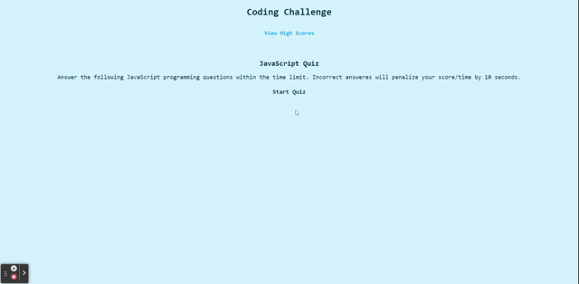

# Coding Challenge

## Description

The Coding Chalenge application was made for the user to take a coding quiz on JavaScript. Upon completion the user can record their score and view previous scores.

## Installation 

N/A

## Usage

Coding Challenge Link: https://itzelherndz.github.io/js-code-quiz/

Users can use this webpage to take a coding quiz and save their score as demonstrated in the following figure. 

After reloading the webpage the user can find previous scores by pressing on "View High Scores".

## Credits

“How to store an array of objects in Local Storage?,” Stack Overflow. https://stackoverflow.com/questions/43762363/how-to-store-an-array-of-objects-in-local-storage (accessed Dec. 19, 2023).

## License

Please refer to LICENSE file in repository.